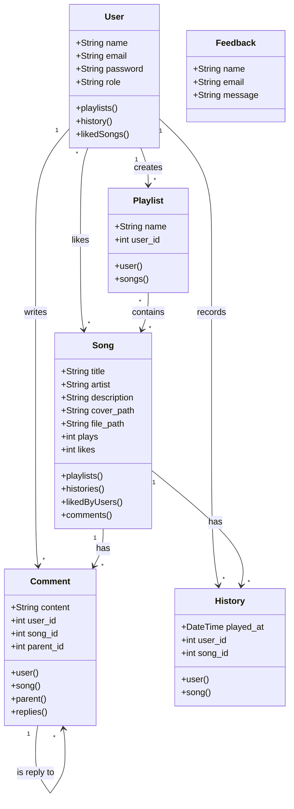

```mermaid
classDiagram
    class User {
        +String name
        +String email
        +String password
        +String role
        +playlists()
        +history()
        +likedSongs()
    }

    class Song {
        +String title
        +String artist
        +String description
        +String cover_path
        +String file_path
        +int plays
        +int likes
        +playlists()
        +histories()
        +likedByUsers()
        +comments()
    }

    class Playlist {
        +String name
        +int user_id
        +user()
        +songs()
    }

    class Comment {
        +String content
        +int user_id
        +int song_id
        +int parent_id
        +user()
        +song()
        +parent()
        +replies()
    }

    class History {
        +DateTime played_at
        +int user_id
        +int song_id
        +user()
        +song()
    }

    class Feedback {
        +String name
        +String email
        +String message
    }

    User "1" --> "*" Playlist : creates
    User "1" --> "*" History : records
    User "*" --> "*" Song : likes
    User "1" --> "*" Comment : writes
    
    Playlist "*" --> "*" Song : contains
    
    Song "1" --> "*" History : has
    Song "1" --> "*" Comment : has
    
    Comment "1" --> "*" Comment : is reply to
```
